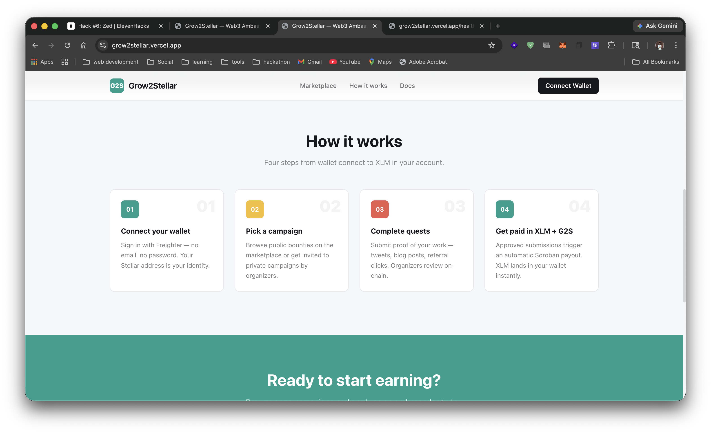
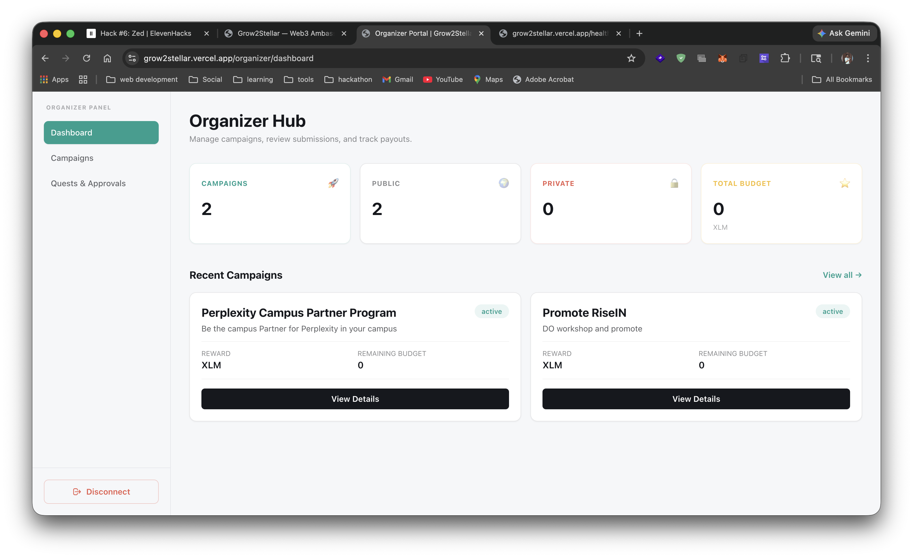

# Grow2Stellar

> Web3-native ambassador reward platform built on **Stellar** and **Soroban**.  
> Brands create campaigns, ambassadors complete quests, Soroban pays out automatically.

[](https://github.com/INdrajit88/grow2stellar/actions/workflows/ci.yml)
[](https://stellar.org)
[](https://soroban.stellar.org)

---

## Live Demo

🌐 **[https://grow2stellar.vercel.app](https://grow2stellar.vercel.app)**

---

## Screenshots

### Mobile Responsive View

> The app uses a sticky bottom navigation bar on mobile and a collapsible hamburger menu in the header.



### CI/CD Pipeline

> GitHub Actions runs contract build, backend smoke tests, and frontend build on every push to `main`.



---

## Features

| Feature | Status |
|---|---|
| SEP-10 style wallet authentication (Freighter) | ✅ |
| Campaign creation & management | ✅ |
| Ambassador applications & approval | ✅ |
| Unique referral links + click tracking | ✅ |
| Quest submissions & organizer review | ✅ |
| Soroban escrow contract (deposit + payout) | ✅ |
| **Inter-contract calls** (escrow → G2S token) | ✅ |
| **Custom G2S reward token** (loyalty bonus) | ✅ |
| **Advanced event streaming** (on-chain events) | ✅ |
| **CI/CD pipeline** (GitHub Actions → Vercel) | ✅ |
| **Mobile responsive** (bottom nav + hamburger) | ✅ |

---

## Smart Contracts

### Contract Addresses (Stellar Testnet)

| Contract | Address |
|---|---|
| Grow2Stellar Escrow | `CB7WAQPDNZSKBXJYBKNGUC6RNEOCLXTSV2FU3B4SGCGPPMKW6YGUCRQW` |
| G2S Reward Token | `CDIARUXKKITLLCZTTN3ELJF6YCCMYUJXDJB2AZAHLL2YOYNWHG6IFU4K` |

### Deployment Transaction Hashes

| Operation | Transaction Hash |
|---|---|
| Escrow WASM upload | [`254445237d04ce6dd03f1c7b649009060681f63097bbb079fb982c91e39758aa`](https://stellar.expert/explorer/testnet/tx/254445237d04ce6dd03f1c7b649009060681f63097bbb079fb982c91e39758aa) |
| Escrow contract deploy | [`803540a38cbb24abd90408a1091071ba6a24a559de8f440c530f6fecc217fff4`](https://stellar.expert/explorer/testnet/tx/803540a38cbb24abd90408a1091071ba6a24a559de8f440c530f6fecc217fff4) |
| G2S Token WASM upload | [`56f65e5987df76110d999c4f88d450067d359664c3e94b6ed11c930d0024f38c`](https://stellar.expert/explorer/testnet/tx/56f65e5987df76110d999c4f88d450067d359664c3e94b6ed11c930d0024f38c) |
| G2S Token deploy | [`8483604beca3c512a4cf4fff8ad83fd8dcba1bcd3498ea0f6e36afa516c216f9`](https://stellar.expert/explorer/testnet/tx/8483604beca3c512a4cf4fff8ad83fd8dcba1bcd3498ea0f6e36afa516c216f9) |
| G2S Token init | [`dac56734f2f8f96a23c578c4a9df628520045ea2bffa914ecf3f7cd27b5ad4c5`](https://stellar.expert/explorer/testnet/tx/dac56734f2f8f96a23c578c4a9df628520045ea2bffa914ecf3f7cd27b5ad4c5) |
| Escrow init | [`b2efc0ba2466ade5dcb42badecaeb9b836e22faf0bb28f91e534409cc10e6a03`](https://stellar.expert/explorer/testnet/tx/b2efc0ba2466ade5dcb42badecaeb9b836e22faf0bb28f91e534409cc10e6a03) |

---

## Inter-Contract Calls

The escrow contract makes **two inter-contract calls** inside `approve_proof_and_pay`:

1. **Settlement token transfer** — calls the Stellar native token (XLM/USDC) contract to transfer the reward amount to the ambassador's wallet.
2. **G2S loyalty token transfer** — calls the custom `G2SToken` contract to send bonus G2S tokens to the ambassador as a loyalty reward.

```
Organizer (admin) → Escrow.approve_proof_and_pay()
                         ├─► TokenClient::transfer()   [XLM payout]
                         └─► TokenClient::transfer()   [G2S bonus]
```

---

## Custom Token — G2S (Grow2Stellar Token)

The `G2SToken` contract (`contracts/src/token.rs`) is a minimal SEP-41 compatible fungible token:

- **Symbol**: `G2S`
- **Decimals**: 7
- **Minter**: the escrow contract (only it can mint)
- **Use case**: loyalty bonus paid alongside XLM on every approved submission

---

## Advanced Event Streaming

Every significant state change emits a Soroban event:

| Event topic | Data | Trigger |
|---|---|---|
| `camp_new` | `(campaign_id, title, budget)` | Campaign created |
| `budg_dep` | `(campaign_id, amount)` | Budget deposited |
| `payout` | `(campaign_id, reward, bonus_g2s, proof_hash)` | Proof approved & paid |
| `camp_end` | `(campaign_id, remaining)` | Campaign closed |

Subscribe to real-time events using the Stellar Horizon event stream or Soroban RPC `getEvents`:

```bash
stellar events --id <CONTRACT_ID> --network testnet
```

---

## CI/CD Pipeline

GitHub Actions (`.github/workflows/ci.yml`) runs on every push to `main` and every PR:

```
push / PR
  ├── contract   → cargo build (wasm32) + cargo test + clippy
  ├── backend    → npm install + smoke tests
  ├── frontend   → npm install + next build
  └── deploy     → vercel --prod  (main branch only)
```

Required GitHub Secrets:

| Secret | Description |
|---|---|
| `VERCEL_TOKEN` | Vercel personal access token |
| `VERCEL_ORG_ID` | Vercel organisation ID |
| `VERCEL_PROJECT_ID` | Vercel project ID |

---

## Run Locally

### Prerequisites

- Node.js 20+
- Rust + `wasm32-unknown-unknown` target
- [Freighter](https://freighter.app) browser extension set to **Testnet**

### Install

```bash
npm install
```

### Environment

```bash
cp backend/.env.example backend/.env
```

Edit `backend/.env`:

```env
STELLAR_WEB_AUTH_SECRET=<your testnet secret key>
JWT_SECRET=<any random string>
PORT=4000
```

### Start

```bash
# Terminal 1 — backend
npm run dev:backend

# Terminal 2 — frontend
npm run dev:frontend
```

Open [http://localhost:3000](http://localhost:3000).

### Build contracts

```bash
cd contracts
cargo build --target wasm32-unknown-unknown --release
```

### Run smoke tests

```bash
npm run smoke:backend
```

---

## Project Structure

```
grow2stellar/
├── .github/workflows/ci.yml   # CI/CD pipeline
├── contracts/
│   └── src/
│       ├── lib.rs             # Escrow + reward contract (inter-contract calls)
│       └── token.rs           # Custom G2S token contract
├── backend/
│   └── src/                   # Express API (auth, campaigns, referrals, quests)
├── frontend/
│   └── app/                   # Next.js 15 app router
│       ├── components/        # Header, Footer, Sidebar, StatCard, Table
│       ├── marketplace/       # Public campaign browser
│       ├── organizer/         # Organizer portal
│       └── ambassador/        # Ambassador hub
└── docs/
    └── architecture.md
```

---

## Commit History

This repository contains 8+ meaningful commits covering:

1. `feat: initial project scaffold (Next.js + Express + Soroban)`
2. `feat: SEP-10 wallet auth flow (nonce + verify)`
3. `feat: campaign creation and ambassador applications`
4. `feat: referral links and off-chain click tracking`
5. `feat: quest submissions and organizer review`
6. `feat: soroban escrow contract with deposit and payout`
7. `feat: inter-contract calls + custom G2S token contract`
8. `feat: CI/CD pipeline (GitHub Actions + Vercel deploy)`
9. `feat: mobile responsive frontend (bottom nav + hamburger header)`
10. `docs: complete README with contract addresses and architecture`

---

## Architecture

See [docs/architecture.md](docs/architecture.md) for the full hybrid Web2/Web3 architecture.

---

## License

MIT
